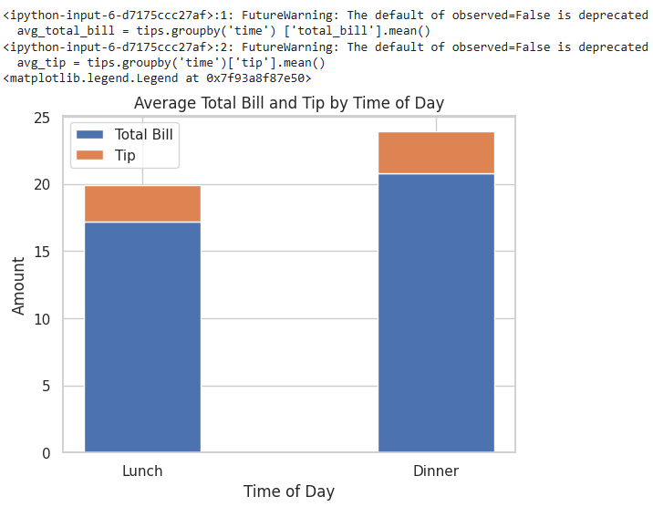
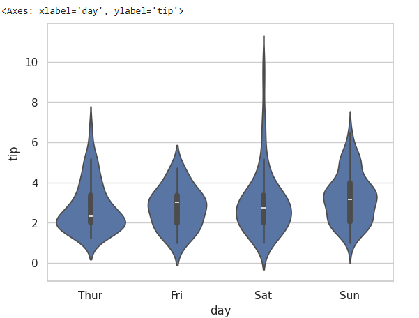
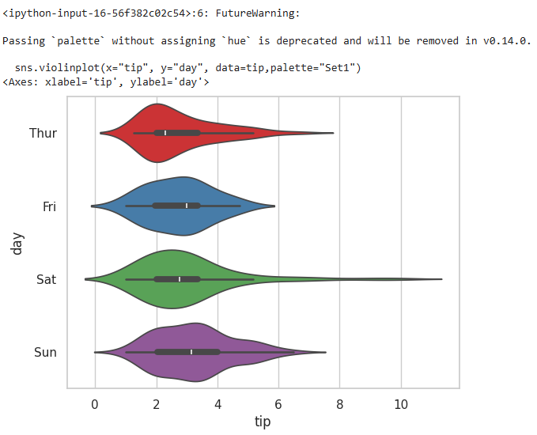
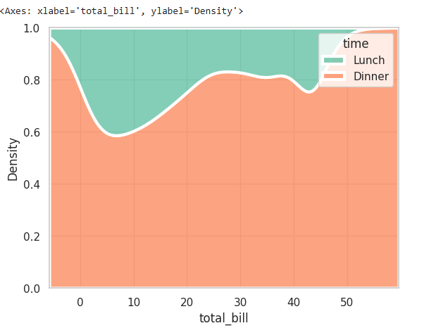

# EXNO-6-DS-DATA VISUALIZATION USING SEABORN LIBRARY

# Aim:
  To Perform Data Visualization using seaborn python library for the given datas.

# EXPLANATION:
Data visualization is the graphical representation of information and data. By using visual elements like charts, graphs, and maps, data visualization tools provide an accessible way to see and understand trends, outliers, and patterns in data.

# Algorithm:
STEP 1:Include the necessary Library.

STEP 2:Read the given Data.

STEP 3:Apply data visualization techniques to identify the patterns of the data.

STEP 4:Apply the various data visualization tools wherever necessary.

STEP 5:Include Necessary parameters in each functions.

# Coding and Output:
```python
import seaborn as sns
import matplotlib.pyplot as plt
import pandas as pd
import numpy as np
df=sns.load_dataset("tips")
df
```

```python
sns.lineplot(x="total_bill",y="tip",data=df,hue="sex",linestyle="solid",legend="auto")
```

```python
import seaborn as sns
import matplotlib.pyplot as plt
# Load the tips dataset
tips = sns.load_dataset('tips')
#Calculate the average total bill and tip for each day of the week
avg_total_bill = tips.groupby('day')['total_bill'].mean()
avg_tip =tips.groupby('day') ['tip'].mean()
plt.figure(figsize=(8, 6))
p1 = plt.bar(avg_total_bill.index, avg_total_bill, label='Total Bill')
p2 = plt.bar(avg_tip.index, avg_tip, bottom=avg_total_bill, label='Tip')
#Set the labels and title
plt.xlabel('Day of the week')
plt.ylabel('Amount')
plt.title('Average Total Bill and Tip by Day')
plt.legend()
```

```python
avg_total_bill = tips.groupby('time') ['total_bill'].mean()
avg_tip = tips.groupby('time')['tip'].mean()
p1 = plt.bar(avg_total_bill.index, avg_total_bill, label='Total Bill', width=0.4)
p2 = plt.bar(avg_tip.index, avg_tip, bottom = avg_total_bill, label='Tip', width=0.4)
plt.xlabel('Time of Day')
plt.ylabel('Amount')
plt.title('Average Total Bill and Tip by Time of Day')
plt.legend()
```

```python
import seaborn as sns
dt= sns.load_dataset('tips')
# Bar plot with hue parameter
sns.barplot(x='day', y='total_bill', hue='sex', data=dt, palette='Set1')
#Set labels and title
plt.xlabel('Day of the week')
plt.ylabel('Total Bill')
plt.title('Total Bill by Day and Gender')
```

```python
tips = sns.load_dataset('tips')
sns.scatterplot(x='total_bill', y='tip', hue='sex', data=tips)
# Set labels and title
plt.xlabel('Total Bill')
plt.ylabel('Tip Amount')
plt.title('Scatter Plot of Total Bill vs. Tip Amount')
```

```python
import seaborn as sns
import matplotlib.pyplot as plt
sns.histplot(data=tips,x="total_bill", hue="smoker", kde=True, palette="Set1")
plt.xlabel("Total Bill")
plt.ylabel("Frequency")
plt.title("Distribution of Total Bill by Gender")
```

```python
import seaborn as sns
import pandas as pd
tips=sns.load_dataset('tips')
sns.boxplot(x=tips['day'], y=tips['total_bill'], hue=tips['sex'])
```

```python
sns.boxplot(x="day", y="total_bill", hue="smoker", data=tips, linewidth=2, width=0.6, boxprops={"facecolor": "red", "edgecolor": "darkblue"},
whiskerprops={"color": "red", "linestyle": "--", "linewidth": 1.5}, capprops={"color": "black", "linestyle": "--", "linewidth": 2})
```

```python
sns.violinplot(x="day", y="total_bill", hue="smoker", data=tips, linewidth=2, width=0.6, palette="Set3", inner="quartile")
#Add labels and title
plt.xlabel("Day of the Week")
plt.ylabel("Total Bill")
plt.title("Violin Plot of Total Bill by Day and Smoker Status")
```

```python
import seaborn as sns
sns.set(style = 'whitegrid')
tip = sns.load_dataset('tips')
sns.violinplot(x ='day', y ='tip', data = tip)
```

```python
import seaborn as sns
sns.set(style = 'whitegrid')
tip = sns.load_dataset('tips')
sns.violinplot(x ='day', y ='tip', data = tip,palette='Set1')
```

```python
sns.set(style = 'whitegrid')
tip = sns.load_dataset('tips')
sns.violinplot(x=tip["total_bill"])
```

```python
import seaborn as sns
# use to set style of background of plot
sns.set(style="whitegrid")
# loading data-set
tips = sns.load_dataset("tips")
sns.violinplot(x="tip", y="day", data=tip,palette="Set1")
```

```python
sns.kdeplot(data=tips,x='total_bill',hue='time',multiple='fill',linewidth=3,palette='Set2',alpha=0.8)
```

```python
sns.kdeplot(data=tips,x='total_bill',hue='time',multiple='stack',linewidth=3,palette='Set1',alpha=0.8)
```

```python
import seaborn as sns
import numpy as np
import matplotlib.pyplot as plt
tips = sns.load_dataset("tips")
numeric_cols = tips.select_dtypes (include=np.number).columns
corr = tips [numeric_cols].corr()
sns.heatmap(corr,annot=True,cmap='plasma',linewidth=0.5)
```


# Result:
  hence, Data visualization using seaborn library is performed successfully
